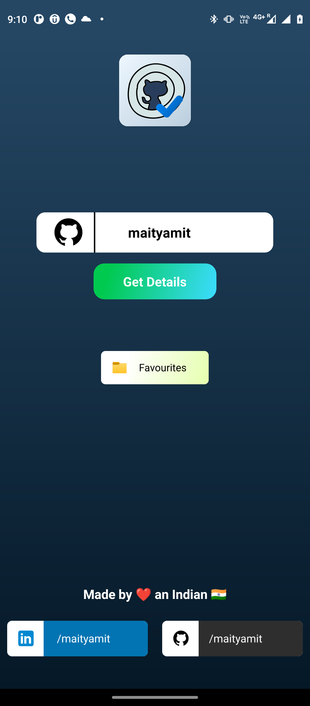
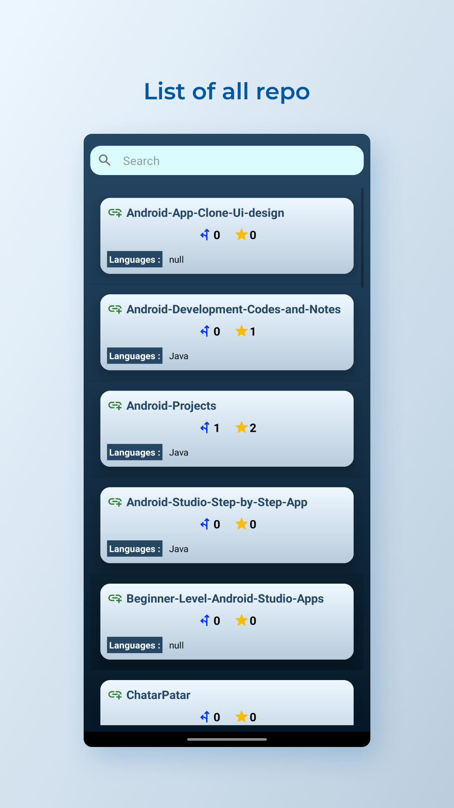
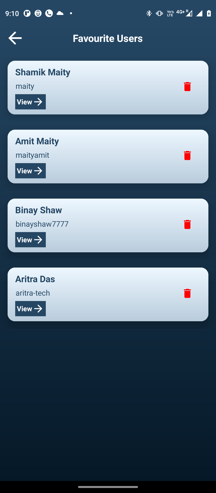
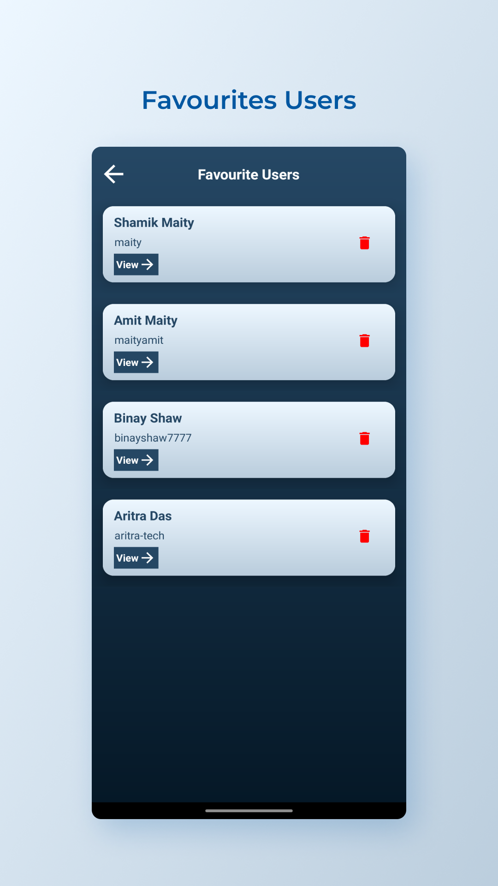

# Github Peek : View and Follow Github Users

GitHub Peek is an application that enables users to view and track the statistics of GitHub users quickly and efficiently. The app's primary features include the ability to search for any GitHub user using their username and retrieve their relevant data. Additionally, users can add their favourite GitHub users to a list for easy tracking and motivation. 
The app employs the GitHub Rest API to fetch all user details by utilizing the user's GitHub username. It also leverages GSON Library to convert Java Objects into their JSON representation and the Picasso Library to cache user images and display them within the app. By providing an easy-to-use interface for viewing GitHub user statistics, GitHub Peek serves as a valuable tool for developers and users who want to keep track of the activity and progress of other GitHub users.

## What I learned from this projects?
Through creating the GitHub Peek application, I gained knowledge in various aspects of Android development. I learned about making API calls and how to integrate APIs, specifically the GitHub API, into an Android application. Additionally, I learned about working with local databases and storage preferences in Android, which allowed me to store user data and provide a seam less user experience. Another significant aspect Of the app was using the Picasso library to fetch and display user profile images in the app. These skills and knowledge are valuable for any developer looking to create applications that integrate with APIs and store user data locally. Overall, the experience Of creating GitHub Peek has provided me with valuable insights into Android development and has equipped me with useful skills for future projects.

## 🔗 Download the App 

## ⚙️ Technology Used

  </a>   <a href="https://www.java.com" target="_blank">  
  
  
   <h1 align=center> Project Admin  🤵 </h1>

  

  

  

  &nbsp;&nbsp;&nbsp;&nbsp;
  &nbsp;&nbsp;&nbsp;&nbsp;
  &nbsp;&nbsp;&nbsp;&nbsp;

  
   
  
## 📸 Screenshots
 
 
 

  
 

||||
|:----------------------------------------:|:-----------------------------------------:|:-----------------------------------------: |
|  |  |  |
|  |  |  |
